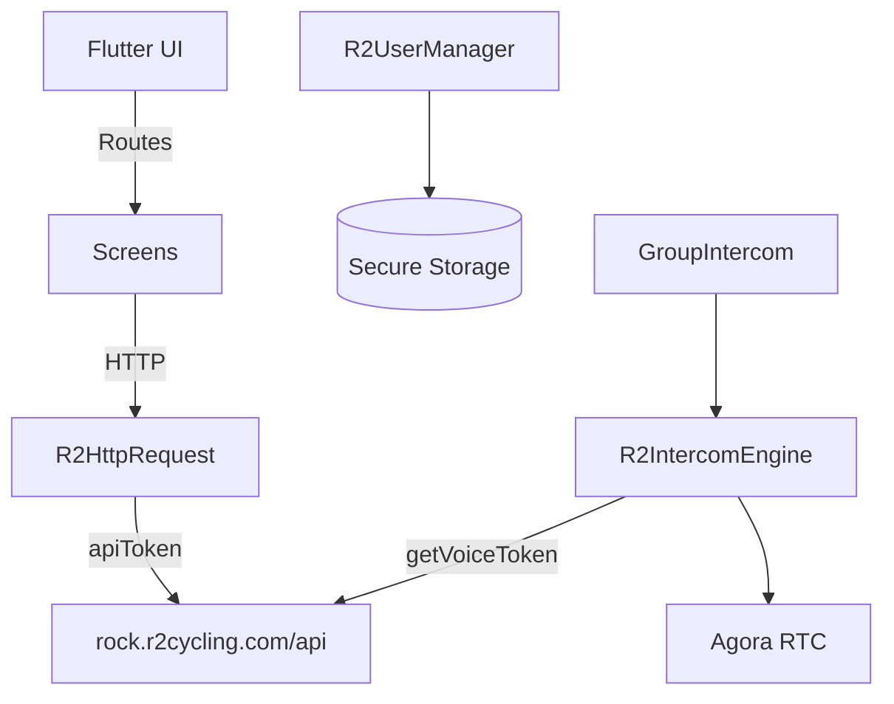
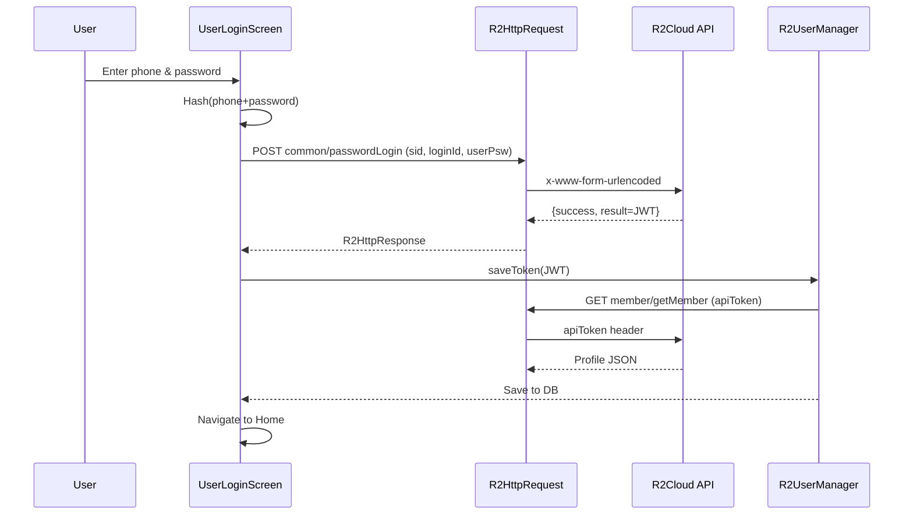

## Current State Overview
- Flutter app with modular directories under `lib/` (UI screens, login, usermanager, connection/http, intercom, database, group, emergency, settings)
- Entry point `lib/main.dart:35-61` initializes services via `appInit`, sets routes (`/home`, `/login`, `/intercom`, etc.) in `lib/main.dart:141-153`
- Server base `https://rock.r2cycling.com/api/` in `lib/connection/http/r2_http_request.dart:22`; `apiToken` header appended when present (`lib/connection/http/r2_http_request.dart:33-36,86-88`)
- Secure storage via `flutter_secure_storage` for tokens (`lib/database/r2_storage.dart:32-38`); additional runtime config saved in secure storage during `appInit` (`lib/main.dart:63-91`)
- Key 3rd-party libraries (from `pubspec.yaml:30-58`): `http`, `agora_rtc_engine`, `flutter_secure_storage`, `shared_preferences`, `sqflite`, `permission_handler`, `flutter_reactive_ble`, `geolocator`, `image_picker`, `crypto`, `uuid`, `flutter_markdown`

## Authentication (Login) Details
- Password login implemented in `lib/login/user_login_screen.dart:96-151`
  - Validates phone (`_isValidPhoneNumber` `lib/login/user_login_screen.dart:68-73`) and password (`_isValidPassword` `lib/login/user_login_screen.dart:81-88`)
  - Constructs `sid` from `SharedPreferences` UUID (`lib/login/user_login_screen.dart:104-112`)
  - Hashes `phone+password` via SHA-512 (`lib/login/user_login_screen.dart:90-94`) and logs both combined plaintext and hashed values (`lib/login/user_login_screen.dart:120-123`) [security risk]
  - Calls `POST common/passwordLogin` via `R2HttpRequest.postRequest` (`lib/connection/http/r2_http_request.dart:24-74`)
  - On success, treats `response.result` as JWT token, saves via `R2UserManager.saveToken` (`lib/usermanager/r2_user_manager.dart:80-86`) then fetches profile `GET member/getMember` (`lib/usermanager/r2_user_manager.dart:164-176`)
- Verification-code login implemented in `lib/login/verification_screen.dart:129-175`
  - Requests SMS code `POST common/sendAuthCode` (`lib/login/verification_screen.dart:65-91`), countdown managed (`lib/login/verification_screen.dart:227-240`)
  - Exchanges phone + code for token `POST common/mobileLogin` (`lib/login/verification_screen.dart:149-156`); saves token and defers navigation via `onTokenRetrieved`
- Token mechanics
  - Token persisted in secure storage (`lib/database/r2_storage.dart:32-42`)
  - JWT decoded to read `exp` and user data (`lib/usermanager/r2_user_manager.dart:34-55,57-78`)
  - Expiry check (`lib/usermanager/r2_user_manager.dart:92-115`), profile sync populates local DB (`lib/usermanager/r2_user_manager.dart:177-221`)
- Network request patterns
  - `Content-Type: application/x-www-form-urlencoded`; token attached as `apiToken` header (`lib/connection/http/r2_http_request.dart:29-36`)

## Intercom (Voice) Details
- UI and orchestration in `lib/group/group_intercom_screen.dart`
  - Loads local account and members (`lib/group/group_intercom_screen.dart:61-68,75-95`)
  - Requests current group `GET cyclingGroup/getMyGroup` (`lib/group/group_intercom_screen.dart:101-116`), saves to local DB, displays members and starts intercom (`lib/group/group_intercom_screen.dart:145-163`)
  - Leave group flow `POST cyclingGroup/leaveGroup` (`lib/group/group_intercom_screen.dart:176-216`)
  - Press-and-hold talk UI: down unmutes, up mutes, cancel stops engine (`lib/group/group_intercom_screen.dart:247-277`)
- Intercom engine `lib/intercom/r2_intercom_engine.dart`
  - Obtains RTC `appId` and `token` via `POST groupRoom/getVoiceToken` with `apiToken` (`lib/intercom/r2_intercom_engine.dart:79-97`)
  - Initializes Agora engine (`lib/intercom/r2_intercom_engine.dart:118-167`), joins channel with `groupID` and `userID` (`lib/intercom/r2_intercom_engine.dart:151-160`)
  - Event handlers for join/leave/speaking (`lib/intercom/r2_intercom_engine.dart:126-147`)
  - Mute/unmute (`lib/intercom/r2_intercom_engine.dart:172-174`), stop (`lib/intercom/r2_intercom_engine.dart:179-183`)
  - Microphone permission via `permission_handler` (`lib/intercom/r2_intercom_engine.dart:103-105`)

## Server & Endpoints Catalog
- Base: `https://rock.r2cycling.com/api/` (`lib/connection/http/r2_http_request.dart:22`)
- Auth: `common/sendAuthCode`, `common/mobileLogin`, `common/passwordLogin` (`lib/login/*` references)
- User: `member/getMember`, `user/modUserInfo`, `tools/upload` (`lib/usermanager/r2_user_manager.dart:164-171,524-556,492-522`)
- Group: `cyclingGroup/getMyGroup`, `cyclingGroup/leaveGroup` (`lib/group/group_intercom_screen.dart:101-116,176-186`)
- Intercom: `groupRoom/getVoiceToken` (`lib/intercom/r2_intercom_engine.dart:79-97`)
- App init: `common/appInit?clientTypeCode` (`lib/main.dart:63-91`)

## Risks & Observations
- Sensitive logging: combined `phone+password` plaintext logged (`lib/login/user_login_screen.dart:120-121`) and hashed (`lib/login/user_login_screen.dart:122-123`)
- Token header name `apiToken` is custom; ensure consistent propagation and renewal flow (new token in `appInit` is saved as `newToken` but not consumed)
- HTTP error handling returns generic 500 on exceptions; consider richer typed errors (`lib/connection/http/r2_http_request.dart:65-73,109-117,169-177`)
- Mixed storage: `sid` in `SharedPreferences` (non-secure) vs token in secure storage; assess session ID sensitivity
- Agora credentials: fallback constants `swAppId`, `swToken` empty; ensure no hardcoding in production (`lib/intercom/r2_intercom_engine.dart:23-26,107-115`)

## Proposed Documentation Files to Generate in `.trae/documents/`
- `tech_architecture.md`
  - Overview of modules, directory map, startup flow, routing
  - Mermaid: system architecture
  - Code references inline to key modules
- `tech_authentication.md`
  - Password and verification-code flows, token lifecycle, storage, profile sync
  - Mermaid: sequence diagram for both login paths
  - Endpoint payloads and headers
- `tech_intercom.md`
  - Group membership fetch, RTC token issuance, Agora engine setup, UI interaction
  - Mermaid: sequence diagram and component diagram (UI ↔ Engine ↔ Server ↔ Agora)
- `tech_server_integration.md`
  - API client conventions, base URL, headers, error handling, upload flow
  - Mermaid: context diagram of app ↔ R2Cloud services
- `prd_user_flows.md`
  - End-user flows for registration/login, join/leave group, intercom interaction
  - Screens, route names, key states
  - Mermaid: user-flow charts
- `security_review.md`
  - Findings (logging credentials, storage choices, token handling), recommendations (remove logs, enforce TLS pinning, structured errors, refresh token handling)
- `refactor_plan.md`
  - Prioritized tasks: security fixes, network layer abstraction, error typing, auth module isolation, intercom engine decoupling, configuration management
  - Each item includes acceptance criteria and impacted files

## Sample Mermaid Blocks to Include
- Architecture

- Login (password)

- Intercom
```mermaid
sequenceDiagram
  participant UI as GroupIntercomScreen
  participant M as R2UserManager
  participant HTTP as R2HttpRequest
  participant S as R2Cloud API
  participant E as R2IntercomEngine
  participant A as Agora RTC
  UI->>M: localAccount()
  UI->>HTTP: GET cyclingGroup/getMyGroup (apiToken)
  HTTP->>S: apiToken header
  S-->>HTTP: {group, memberList}
  UI->>E: getInstance(groupID,userID)
  E->>HTTP: POST groupRoom/getVoiceToken (apiToken)
  HTTP->>S: apiToken header
  S-->>HTTP: {appId, token}
  E->>A: initialize & join(channel=groupID, userAccount=userID)
  UI->>E: press & hold → mute=false; release → mute=true
```

## Implementation Plan
1. Generate the seven Markdown files under `.trae/documents/` with the outlined content and code references
2. Embed Mermaid diagrams in each relevant file; validate rendering
3. Add a short index `README.md` in `.trae/documents/` linking to each document
4. Review for completeness and adjust based on any additional areas you want covered (payments, BLE pairing, emergency)

## Request for Confirmation
- Confirm the file list and section structure
- Confirm focus areas (auth, intercom, server, user flows, security, refactor)
- If you prefer different grouping (e.g., combine tech_* into one), I will adjust accordingly