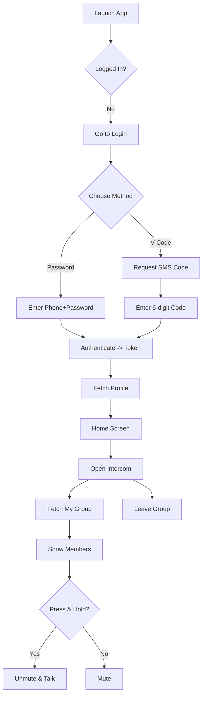

# Product Flows — Key User Journeys

## Registration & Login
- Register/login via verification code: request code, enter 6-digit code, obtain token; navigate to Home `lib/login/verification_screen.dart:65-91,129-175,317-323`
- Password login: enter phone and password, authenticate, fetch profile, go Home `lib/login/user_login_screen.dart:96-160,345-358`

## Group Intercom
- Enter Intercom: fetch current group; show members; press-and-hold to talk; leave group from app bar `lib/group/group_intercom_screen.dart:101-163,404-449`

## Settings & Profile
- Update nickname and avatar; avatar upload and sync flows with local cache `lib/usermanager/r2_user_manager.dart:237-250,342-391,492-522,524-556`

## Routing
- Primary routes configured in `lib/main.dart:141-153`

## Flowchart — Login and Intercom

