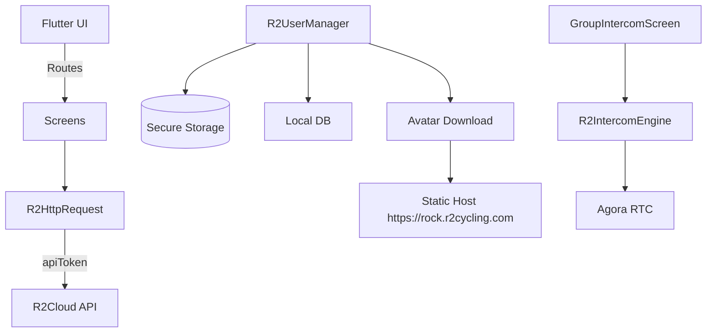

# R2 Cycling App — Technical Architecture

## Overview
- Flutter application with modular organization under `lib/` for UI, networking, storage, intercom, user and group management
- Entry point initializes services and routes; network base and secure storage configured at startup
- Key third-party packages: `http`, `agora_rtc_engine`, `flutter_secure_storage`, `shared_preferences`, `sqflite`, `permission_handler`, `flutter_reactive_ble`, `geolocator`, `image_picker`, `crypto`, `uuid`, `flutter_markdown`

## Entry Points
- App startup and error guards in `lib/main.dart:35-61`
- Service initialization (`appInit`) persists runtime config in secure storage `lib/main.dart:63-91`
- Routes configured in `lib/main.dart:141-153` (`/home`, `/register`, `/login`, `/bluetooth_pairing`, `/groupList`, `/intercom`, `/emergencyContact`, `/settings`, `/profile`)

## Directory Map
- `lib/screens` core UI screens
- `lib/login` authentication flows and base screen classes
- `lib/usermanager` account, group, profile models and storage orchestration
- `lib/connection/http` HTTP client (`R2HttpRequest`) and response wrapper (`R2HttpResponse`)
- `lib/intercom` voice intercom engine wrapper around Agora SDK
- `lib/group` group list and intercom screen
- `lib/database` local persistence helpers: secure storage, DB helper
- `lib/connection/bt` BLE device models and commands
- `lib/emergency` SOS features
- `lib/settings` user settings and profile UI
- `lib/l10n` localization
- `assets/configs` runtime BLE device configs

## Networking Layer
- Base URL: `https://rock.r2cycling.com/api/` in `lib/connection/http/r2_http_request.dart:22`
- Requests send `Content-Type: application/x-www-form-urlencoded` and attach `apiToken` when present (`lib/connection/http/r2_http_request.dart:29-36,86-88`)
- File uploads use multipart with optional thumbnail params (`lib/connection/http/r2_http_request.dart:120-178`)
- Response parsing and JSON coercion handled in `lib/connection/http/r2_http_response.dart:57-67`

## Storage & Configuration
- Secure storage of JWT token (`authtoken`) in `lib/database/r2_storage.dart:32-42`
- Additional runtime config (e.g., `fileDomain`) saved in `appInit` and later used for static downloads (`lib/main.dart:63-91`, `lib/usermanager/r2_user_manager.dart:274-289`)

## Intercom Subsystem
- UI orchestration in `lib/group/group_intercom_screen.dart:101-163,247-277,465-467`
- Engine setup and lifecycle: `lib/intercom/r2_intercom_engine.dart:79-97,118-167,179-183`

## Authentication Subsystem
- Password login in `lib/login/user_login_screen.dart:96-151`
- Verification-code login in `lib/login/verification_screen.dart:129-175`
- Profile retrieval and local cache population in `lib/usermanager/r2_user_manager.dart:164-221`

## Platform Integration
- Android `MainActivity` for method channel (SMS) and manifest permissions
- iOS `Info.plist` for microphone and background usage declarations

## Architecture Diagram

