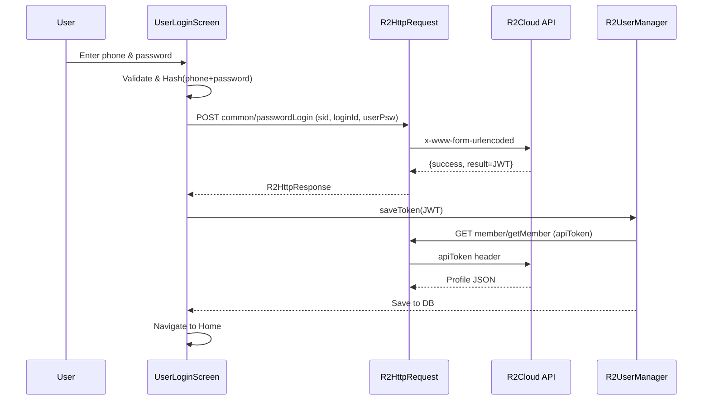
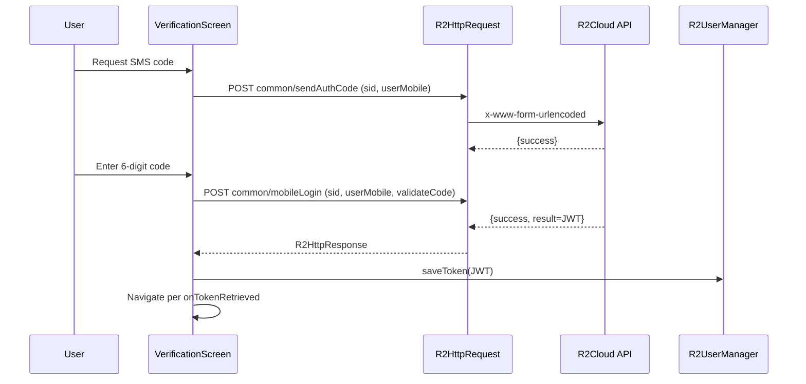

# Authentication — Flows and Mechanics

## Password Login
- Input validation for phone and password in `lib/login/user_login_screen.dart:68-73,81-88`
- `sid` (session ID) persisted via `SharedPreferences` UUID `lib/login/user_login_screen.dart:104-112`
- Hash `phone+password` using SHA-512 `lib/login/user_login_screen.dart:90-94`
- Request `POST common/passwordLogin` using `R2HttpRequest.postRequest` `lib/login/user_login_screen.dart:124-133`, client impl `lib/connection/http/r2_http_request.dart:24-74`
- On success, save JWT via `R2UserManager.saveToken` `lib/usermanager/r2_user_manager.dart:80-86` and fetch profile `GET member/getMember` `lib/usermanager/r2_user_manager.dart:164-176`

## Verification-Code Login
- Request SMS code `POST common/sendAuthCode` `lib/login/verification_screen.dart:65-91`
- Exchange code for token `POST common/mobileLogin` `lib/login/verification_screen.dart:149-156`
- Save token and navigate through `onTokenRetrieved` `lib/login/verification_screen.dart:169-175,277-279`

## Token Handling
- JWT stored in secure storage (`authtoken`) `lib/database/r2_storage.dart:32-42`
- Decode and read `exp` and `data` from JWT `lib/usermanager/r2_user_manager.dart:34-55,57-78`
- Expiry check `lib/usermanager/r2_user_manager.dart:92-115`
-
## Profile & Local Cache
- `GET member/getMember` yields account, group and device info, saved to local DB `lib/usermanager/r2_user_manager.dart:176-221`
- Avatar download path constructed from `fileDomain` and saved filename `lib/usermanager/r2_user_manager.dart:274-321`

## Request Conventions
- Headers: `Content-Type: application/x-www-form-urlencoded`; `apiToken` when authenticated `lib/connection/http/r2_http_request.dart:29-36,86-88`
- Response wrapper returns `{success,message,code,result}` `lib/connection/http/r2_http_response.dart:57-67`

## Sequence — Password Login

## Sequence — Verification-Code Login

