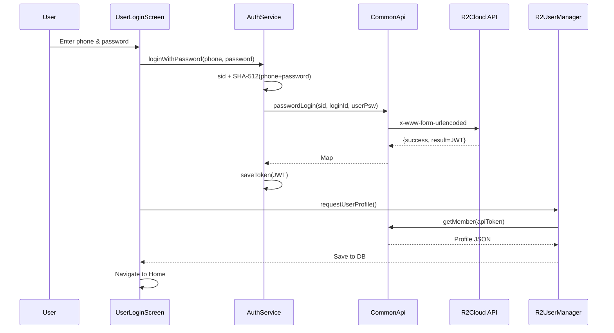
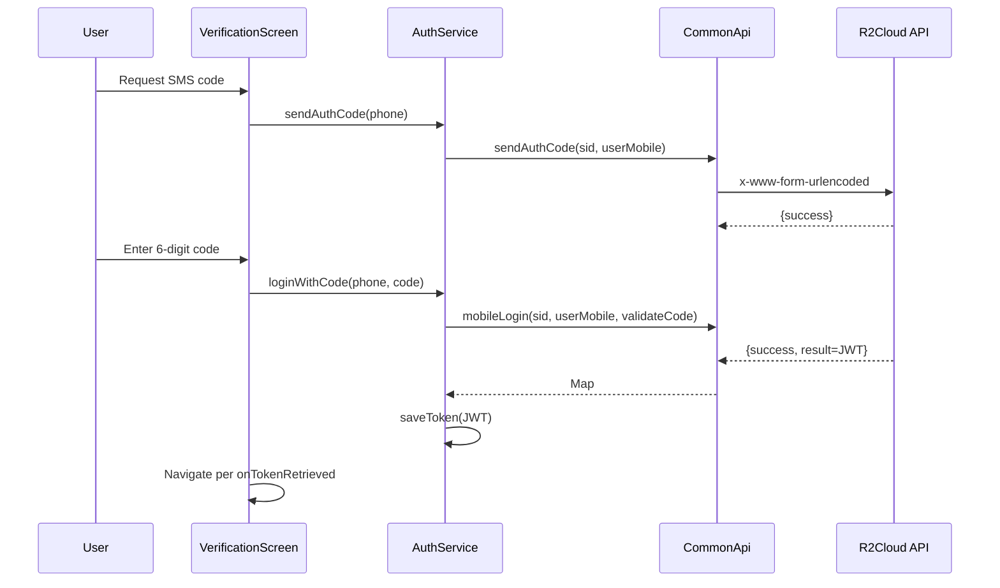

# Authentication — Flows and Mechanics

## Password Login
- Input validation for phone and password in `lib/login/user_login_screen.dart`.
- `sid` UUID persisted via `SharedPreferences` handled inside `lib/auth/auth_service.dart`.
- Hash `phone+password` using SHA-512 inside `AuthService`.
- Request `POST common/passwordLogin` via `CommonApi.passwordLogin` and `ApiClient`.
- On success, `AuthService.saveToken` persists JWT; screen then fetches profile via `R2UserManager.requestUserProfile()`.

## Verification-Code Login
- Request SMS code via `CommonApi.sendAuthCode` using `AuthService.sendAuthCode` from the screen.
- Exchange code for token via `CommonApi.mobileLogin` using `AuthService.loginWithCode`.
- `AuthService.saveToken` persists the token; screen navigates via its existing callback.

## Token Handling
- JWT stored in secure storage (`authtoken`) in `lib/database/r2_storage.dart` through `AuthService`.
- Decode `exp` and check expiry in `lib/auth/auth_service.dart:120-132`.
- Home guard: `lib/screens/home_screen.dart:105-115` uses `AuthService.readToken` and `expiredToken` to redirect to registration when missing or expired.

## Profile & Local Cache
- `GET member/getMember` via `CommonApi` populates account, group and device info; saved to local DB in `lib/usermanager/r2_user_manager.dart`.
- Avatars downloaded via `CommonApi.getImageBytes` and cached in `R2UserManager`.

## Request Conventions
- Headers: `Content-Type: application/x-www-form-urlencoded`; `apiToken` when authenticated, handled by `ApiClient`.
- Typed response wrapper: `R2HttpResponse<T>` with `success`, `code`, `message`, `result` `lib/connection/http/openapi/api_client.dart:243-268`.

## Sequence — Password Login

## Sequence — Verification-Code Login

