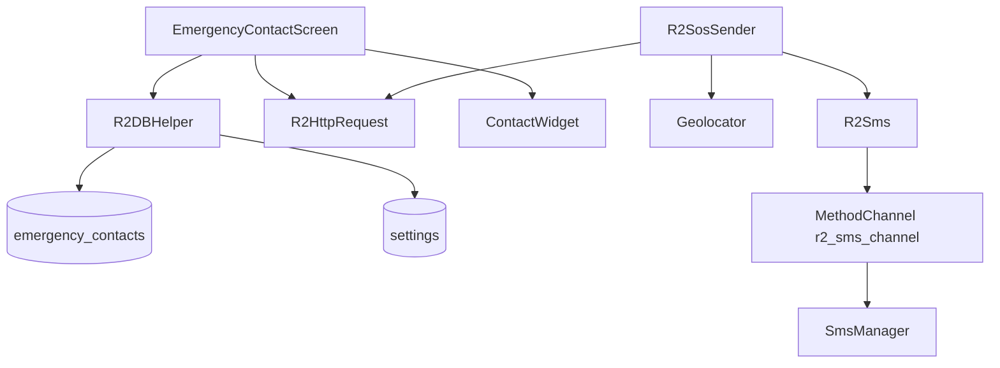
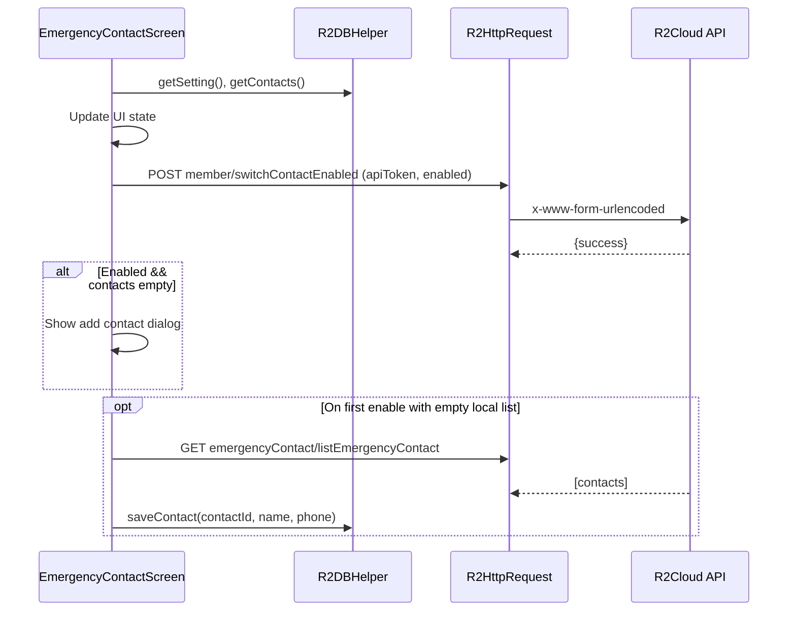
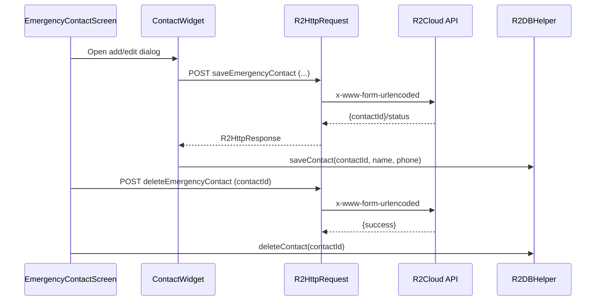
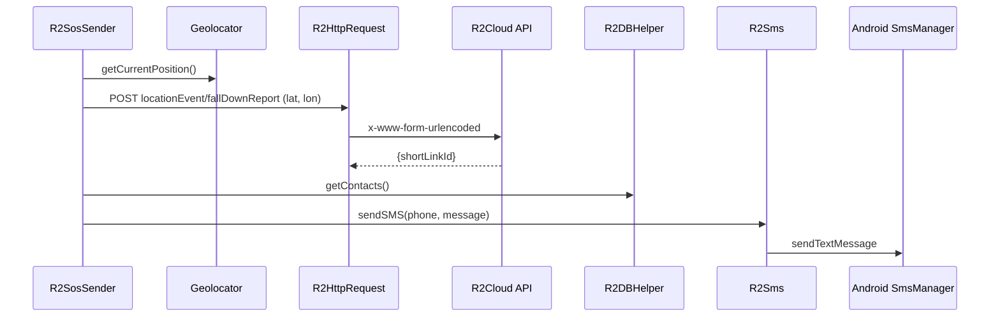

# Emergency Contacts — Technical Analysis

## Overview
- UI entry: `lib/emergency/emergency_contact_screen.dart` manages enable switch, local list, and dialog for add/edit/delete
- Dialog: `lib/emergency/contact_widget.dart` collects `name` and `phone`, supports delete/edit
- SOS sending: `lib/emergency/r2_sos_sender.dart` composes message with location and sends SMS to all contacts
- SMS bridge: `lib/emergency/r2_sms.dart` invokes method channel `r2_sms_channel` implemented in Android `android/app/src/main/kotlin/com/rockroad/r2cyclingapp/MainActivity.kt:32-77`
- Persistence: `lib/database/r2_db_helper.dart` stores `emergency_contacts` and `settings.emergencyContactEnabled`

## Data & Storage
- Local DB schema (`lib/database/r2_db_helper.dart:45-59`):
  - `emergency_contacts(contactId INTEGER PRIMARY KEY, name TEXT, phone TEXT)`
  - `settings(id INTEGER PRIMARY KEY, emergencyContactEnabled INTEGER)`
- Settings helpers: save/read and `saveEmergencyContactEnabled` (`lib/database/r2_db_helper.dart:225-246`)
- Contact helpers: `saveContact`, `getContacts`, `deleteContact` (`lib/database/r2_db_helper.dart:184-223`)

## Server Endpoints
- Enable/disable: `POST member/switchContactEnabled` with `emergencyContactEnabled` (`lib/emergency/emergency_contact_screen.dart:333-349`)
- Add/update: `POST emergencyContact/saveEmergencyContact` (`lib/emergency/emergency_contact_screen.dart:359-378,389-408`)
- Delete: `POST emergencyContact/deleteEmergencyContact` (`lib/emergency/emergency_contact_screen.dart:410-427`)
- List all: `GET emergencyContact/listEmergencyContact` (`lib/emergency/emergency_contact_screen.dart:435-458`)
- Short address for SOS: `POST locationEvent/fallDownReport` (`lib/emergency/r2_sos_sender.dart:28-47`)

## UI Logic
- Toggle switch updates local setting and server, prompts add contact when enabled but list empty (`lib/emergency/emergency_contact_screen.dart:59-71,62-64`)
- Shows up to 3 contacts, offers add if less than 3 (`lib/emergency/emergency_contact_screen.dart:229-258`)
- Add/edit dialogs wire `onSave`/`onDelete` callbacks to CRUD methods (`lib/emergency/emergency_contact_screen.dart:144-161,163-188`)

## SOS Sending
- Gets current GPS via `geolocator` (`lib/emergency/r2_sos_sender.dart:52-60`)
- Requests short link for location from server (`lib/emergency/r2_sos_sender.dart:28-47`)
- Builds localized message and sends to all contacts via method channel (`lib/emergency/r2_sos_sender.dart:72-79`, `lib/emergency/r2_sms.dart:21-31`)
- Android side uses `SmsManager.sendTextMessage` (`android/app/src/main/kotlin/com/rockroad/r2cyclingapp/MainActivity.kt:39-49`)

## Components Diagram

## Sequence — Enable Toggle & Fetch

## Sequence — Add/Update/Delete Contact

## Sequence — SOS Send

## Notes
- UI limits to 3 contacts; enabling with zero contacts prompts add
- HTTP headers include `apiToken` when authenticated (`lib/connection/http/r2_http_request.dart:33-36,85-88`)
- Geolocation requires runtime permissions; ensure platform privacy strings and permission flows are in place
