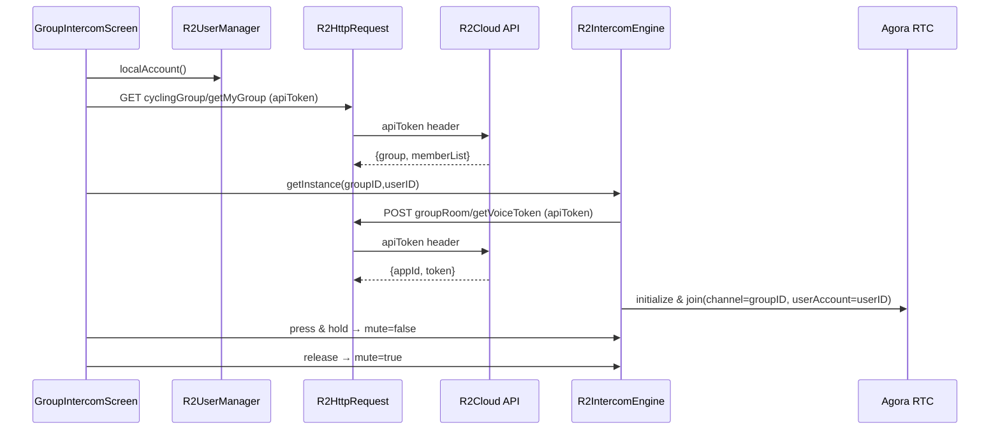
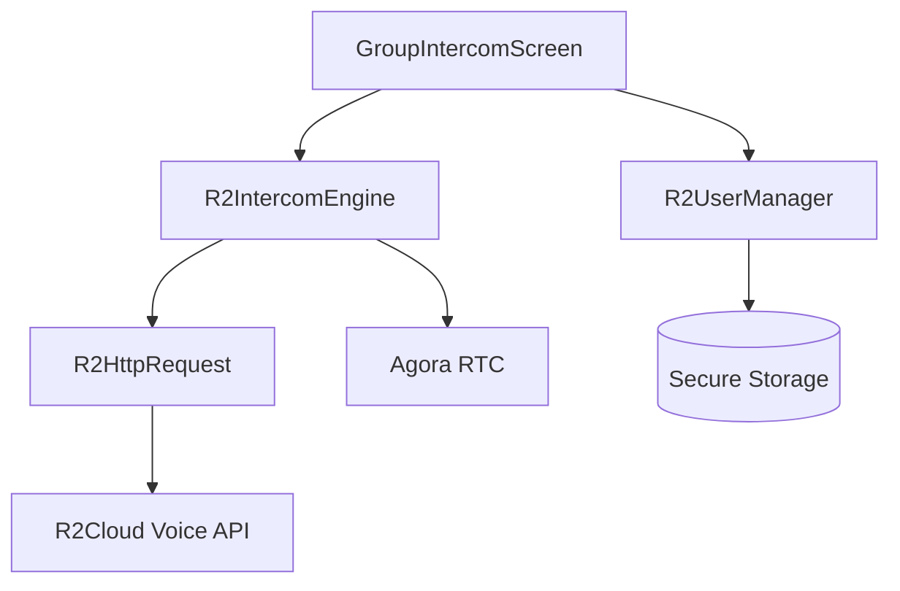

# Intercom — Architecture and Flow

## Group Intercom UI

* Fetch current group and members `GET cyclingGroup/getMyGroup` `lib/group/group_intercom_screen.dart:101-116`

* Save group locally and display member list `lib/group/group_intercom_screen.dart:145-163`

* Press-and-hold button: down unmutes, up mutes, cancel stops engine `lib/group/group_intercom_screen.dart:247-277`

* Leave group `POST cyclingGroup/leaveGroup` and clean local cache `lib/group/group_intercom_screen.dart:176-216`

## Intercom Engine (Agora)

* Obtain RTC credentials `POST groupRoom/getVoiceToken` `lib/intercom/r2_intercom_engine.dart:79-97`

* Initialize engine and join channel `lib/intercom/r2_intercom_engine.dart:118-167,151-160`

* Event handlers for member lifecycle and active speaker `lib/intercom/r2_intercom_engine.dart:126-147`

* Mic permissions via `permission_handler` `lib/intercom/r2_intercom_engine.dart:103-105`

## Data & Identity

* Channel ID equals `cyclingGroupId`; `userAccount` equals local user ID `lib/intercom/r2_intercom_engine.dart:151-160`

## Sequence — Intercom Session

## Components

*  
