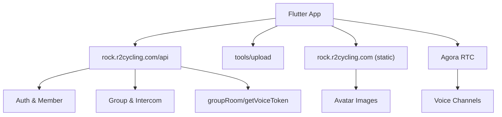

# Server Integration — API Client and Endpoints

## HTTP Client

* Base URL `https://rock.r2cycling.com/api/` `lib/connection/http/r2_http_request.dart:22`

* `postRequest` and `getRequest` append `apiToken` when provided `lib/connection/http/r2_http_request.dart:33-36,85-88`

* Uploads use multipart; thumbnails for `tools/upload` `lib/connection/http/r2_http_request.dart:138-146`

* Errors mapped to `R2HttpResponse` with `success=false` `lib/connection/http/r2_http_request.dart:58-64,102-108,162-168`

## Common Endpoints

* App init: `GET common/appInit?clientTypeCode=...` `lib/main.dart:63-91`

* Auth: `POST common/sendAuthCode`, `POST common/mobileLogin`, `POST common/passwordLogin` `lib/login/*`

* User profile: `GET member/getMember` `lib/usermanager/r2_user_manager.dart:164-171`

* User update: `POST user/modUserInfo` (avatar, nickname) `lib/usermanager/r2_user_manager.dart:540-556`

* File upload: `POST tools/upload` `lib/usermanager/r2_user_manager.dart:492-522`

* Group: `GET cyclingGroup/getMyGroup`, `POST cyclingGroup/leaveGroup` `lib/group/group_intercom_screen.dart:101-116,176-186`

* Intercom: `POST groupRoom/getVoiceToken` `lib/intercom/r2_intercom_engine.dart:79-97`

## Static File Host

* Download avatars via `https://rock.r2cycling.com` + `fileDomain` + `filename` `lib/usermanager/r2_user_manager.dart:287-321`

## Context Diagram

