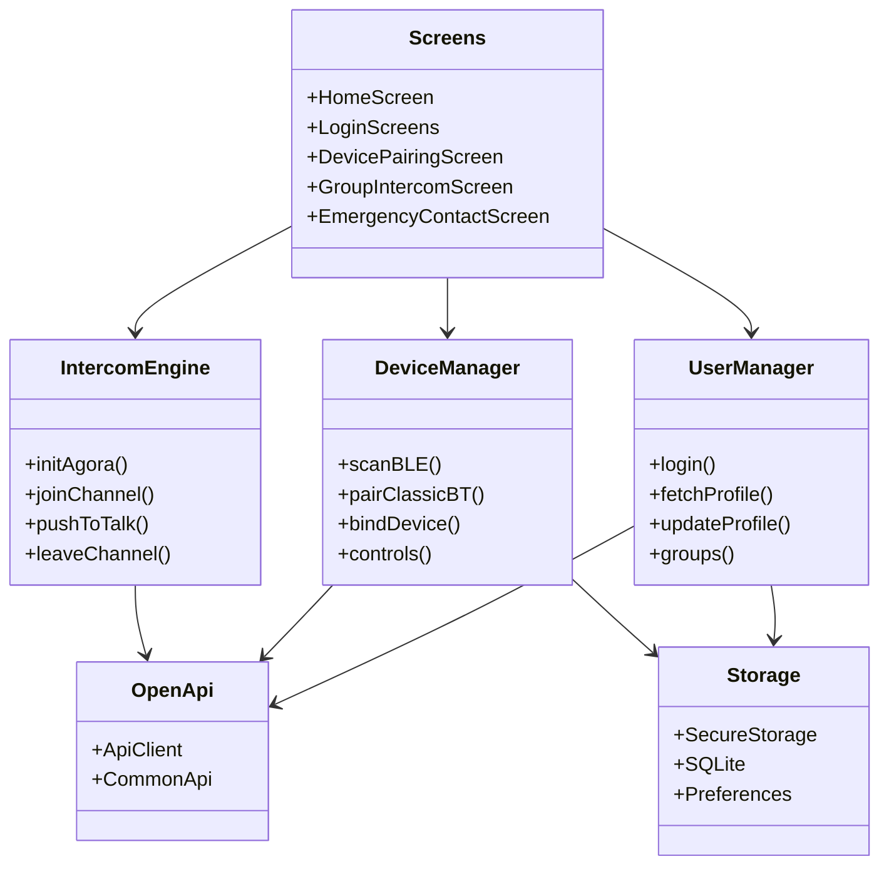

# Tech Plan — Flutter, UML Modules, OpenAPI

## Goals
- Cross-platform Flutter app for Android and iOS.
- Clear module boundaries documented with UML-style diagrams.
- HTTP integration governed by a single OpenAPI source of truth.

## Technology Rules
- Flutter as the only UI framework; native code limited to platform channels.
- Modules organized under `lib/` by responsibility; UI is declarative, business logic in services/managers.
- Networking follows OpenAPI spec; client layer centralized in `lib/connection/http/openapi/`.
- HTTP headers: `Content-Type: application/x-www-form-urlencoded`; authenticated requests include `apiToken` `lib/connection/http/openapi/api_client.dart:30-36`.
- JWT tokens stored in secure storage; managers read expiry and enforce re-auth `lib/database/r2_storage.dart:32-42`, `lib/usermanager/r2_user_manager.dart:92-115`.
- Errors surfaced via structured responses; avoid throwing raw exceptions in UI; map to user messages.

## Module Design (UML)
- Core modules:
  - `Screens`: top-level routes and UI.
  - `UserManager`: account, group, profile state.
  - `DeviceManager`: helmet pairing and device control.
  - `IntercomEngine`: Agora RTC orchestration.
  - `OpenApi`: HTTP client and API wrappers.
  - `Storage`: secure and local persistence.

## Module Boundaries & Dependencies
- `Screens` depend on `UserManager`, `DeviceManager`, `IntercomEngine` via injected instances or service locators.
- `Managers` depend on `OpenApi` and `Storage`; `IntercomEngine` depends on Agora SDK and `OpenApi` for tokens.
- `OpenApi` wraps HTTP and is the single access path to server endpoints.
- `Storage` abstracts secure (tokens) and local DB (devices, contacts).
- `Emergency` screens depend on `R2SosSender` and `R2Sms` for platform SMS.

## OpenAPI for HTTP Requests
- Source of truth: `config/openapi.yaml`.
- Client implementation: `lib/openapi/api_client.dart` and `lib/openapi/common_api.dart` provide typed wrappers that match the OpenAPI spec.
- Rules:
  - Add or change endpoints only after updating `config/openapi.yaml`.
  - Mirror changes in `CommonApi` with method names reflecting server paths.
  - Use `ApiClient` for all requests; no ad-hoc `http` usage outside `lib/openapi`.
  - Responses parsed into structured maps; managers convert to domain models.
  - File uploads use multipart with thumbnails where applicable.
- Base URL: `https://rock.r2cycling.com/api/` `lib/openapi/api_client.dart:20-22`.
- Standard endpoints used by managers and screens: auth, profile, group, intercom, emergency `lib/openapi/common_api.dart:24-279`.

## Cross-Platform Conventions
- UI and logic identical across Android/iOS; conditionally handle permissions and platform channels only where necessary.
- iOS `Info.plist` and Android `AndroidManifest.xml` must declare Bluetooth, location, microphone, SMS usage strings.
- Assets and icons are resolution-aware; localization via `AppLocalizations`.
- Permissions managed via `permission_handler`; microphone required for intercom `lib/intercom/r2_intercom_engine.dart:103-105`.

## Implementation Checklist
- Enforce module boundaries with clear imports and limit cyclic dependencies.
- Document changes by updating mermaid diagrams in this plan and `tech_architecture.md`.
- Add new endpoints to `openapi.yaml` and `CommonApi` before using in managers.
- Keep pairing logic inside `DeviceManager`; screens only orchestrate UI events.
- Intercom push-to-talk controlled by `IntercomEngine` with Agora SDK.
- Emergency: limit to 3 contacts; toggle behavior prompts add when none; persist locally and sync with server.

## Testing & CI
- Unit tests: `UserManager`, `DeviceManager`, `IntercomEngine` business logic.
- Widget tests: screens interactions and state transitions.
- Integration tests: login, pairing, intercom join/talk/leave, SOS trigger.
- CI runs `flutter analyze` and `flutter test`; block merges on failure.

## Subsystem Rules

### Intercom
- Fetch group and members before initializing engine `lib/group/group_intercom_screen.dart:101-163`.
- Obtain RTC credentials via `CommonApi.getVoiceToken` `lib/openapi/common_api.dart:219-228`; engine initializes and joins channel `lib/intercom/r2_intercom_engine.dart:118-167,151-160`.
- Channel ID equals `cyclingGroupId`; `userAccount` equals local user ID `lib/intercom/r2_intercom_engine.dart:151-160`.
- Press-and-hold UX: down unmutes, up mutes; cancel stops engine `lib/group/group_intercom_screen.dart:247-277`.
- Leave group triggers server `leaveGroup` and local cleanup `lib/group/group_intercom_screen.dart:176-216`.
- Handle mic permissions and engine lifecycle events `lib/intercom/r2_intercom_engine.dart:103-147`.

### Authentication
- Password login: validate inputs, generate `sid` UUID, SHA-512 hash `phone+password`, call `passwordLogin` `lib/login/user_login_screen.dart:68-94,104-133`.
- Verification-code login: request SMS code then exchange for token `lib/login/verification_screen.dart:65-91,149-156`.
- On success, save JWT and fetch profile; navigate to Home `lib/usermanager/r2_user_manager.dart:80-86,164-176`.
- Token storage and expiry enforcement `lib/database/r2_storage.dart:32-42`, `lib/usermanager/r2_user_manager.dart:34-78,92-115`.

### Emergency
- Toggle `SOS` enabled; prompt add contact when empty; limit to 3 contacts `lib/emergency/emergency_contact_screen.dart:59-71,229-258`.
- Server sync for enabled state and CRUD operations `lib/openapi/common_api.dart:167-218`.
- SOS send: get GPS, request short link, build message, send SMS to all contacts `lib/emergency/r2_sos_sender.dart:28-79`.
- Android SMS via method channel `r2_sms_channel` `android/app/src/main/kotlin/com/rockroad/r2cyclingapp/MainActivity.kt:32-77`; iOS uses platform-specific flow if available.
- Local DB schema and helpers for contacts/settings `lib/database/r2_db_helper.dart:45-59,184-246`.

### Server Integration
- All HTTP interactions use `ApiClient` and `CommonApi` wrappers `lib/openapi/api_client.dart:19-217`, `lib/openapi/common_api.dart:18-279`.
- Requests include `apiToken` when authenticated; responses parsed consistently.
- Multipart uploads with thumbnail fields for images.

### Architecture
- Entry-point initialization and routing `lib/main.dart:35-91,141-153`.
- Keep diagrams in `tech_architecture.md` updated when modules evolve.
